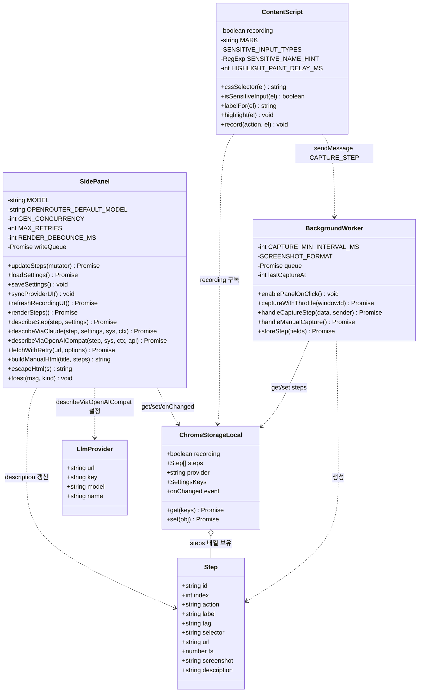

# UML 클래스 다이어그램 — Manual Capture

이 확장은 클래스가 아닌 **모듈/함수 단위**로 구성됩니다. 아래 다이어그램은 3개 격리 컨텍스트를 모듈 "클래스"로, 주요 함수를 메서드로 표현합니다. 상수는 속성으로 표기합니다.

## 레이어/책임 요약

| 모듈 | 컨텍스트 | 단일 책임 |
|---|---|---|
| `ContentScript` | 페이지 주입 | 이벤트 감지, 요소 강조, 메타데이터 수집·전송 |
| `BackgroundWorker` | service worker | 스크린샷 캡처(스로틀), 단계 저장 직렬화 |
| `SidePanel` | 사이드패널 | 렌더링, LLM 호출(동시성·재시도), 편집, 내보내기 |
| `ChromeStorageLocal` | 브라우저 API | 상태 영속화 + 컨텍스트 간 동기화 채널 |
| `Step` | 데이터 모델 | 단계 레코드 |
| `LlmProvider` | 설정 구조체 | OpenAI 호환 호출 파라미터 묶음 |

## 관계 표기 설명

- `..>` (의존): 메시지 전송 또는 API 호출로 일시적 의존
- `o--` (집합): `ChromeStorageLocal`이 `Step` 배열을 보유하나 생명주기는 독립
