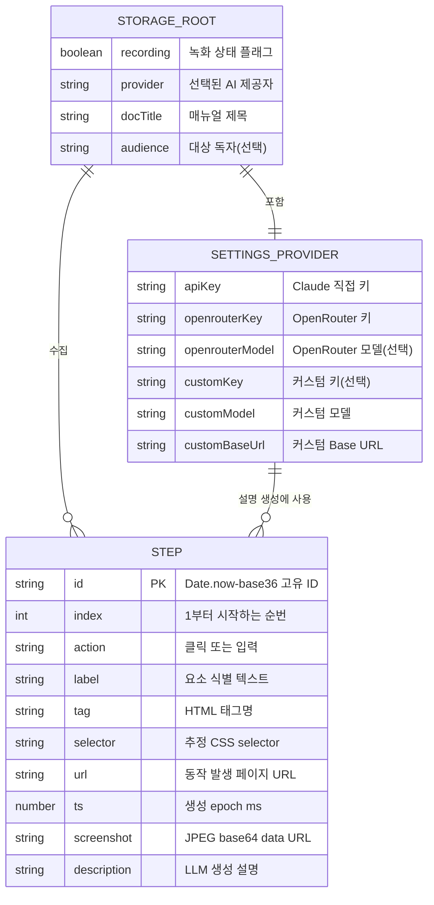

# ER 다이어그램 — Manual Capture

이 확장은 관계형 DB를 사용하지 않고 `chrome.storage.local`에 키-값으로 저장합니다(→ [DB 설계 문서](database-design.md)). 아래 ER 다이어그램은 논리적 데이터 모델(저장 키 간의 개념적 관계)을 표현합니다.

## 관계 설명

| 관계 | 표기 | 의미 |
|---|---|---|
| STORAGE_ROOT — SETTINGS_PROVIDER | 1:1 | 단일 storage 루트가 하나의 설정 묶음을 가짐 |
| STORAGE_ROOT — STEP | 1:N | `steps` 배열이 0개 이상의 단계 레코드를 보유 |
| SETTINGS_PROVIDER — STEP | 1:N (논리) | 선택된 제공자/모델 설정이 각 단계의 `description` 생성에 사용됨 |

> 물리적으로는 모두 `chrome.storage.local`의 평면(flat) 키이며, `STEP`만 `steps` 키 아래 배열로 중첩 저장됩니다. PK인 `id`는 단계 편집·삭제 시 대상 식별에 사용됩니다(외래키 제약은 없음 — 애플리케이션 레벨 참조).
