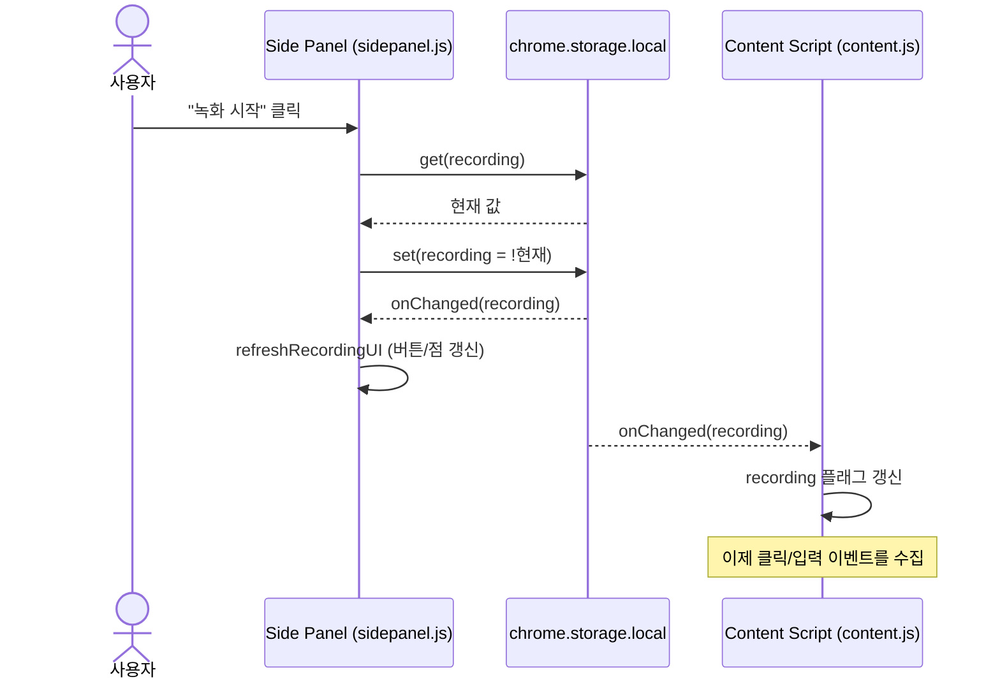
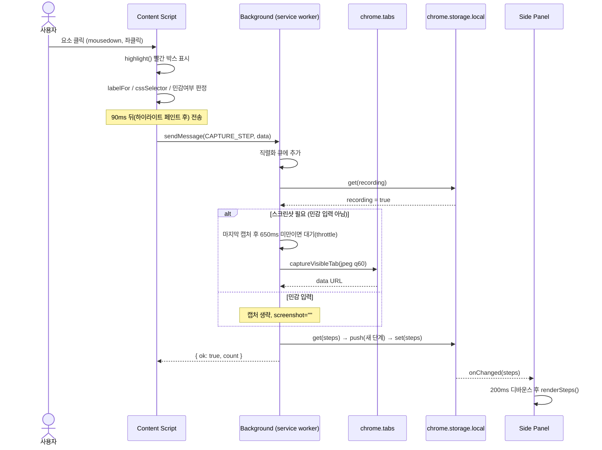
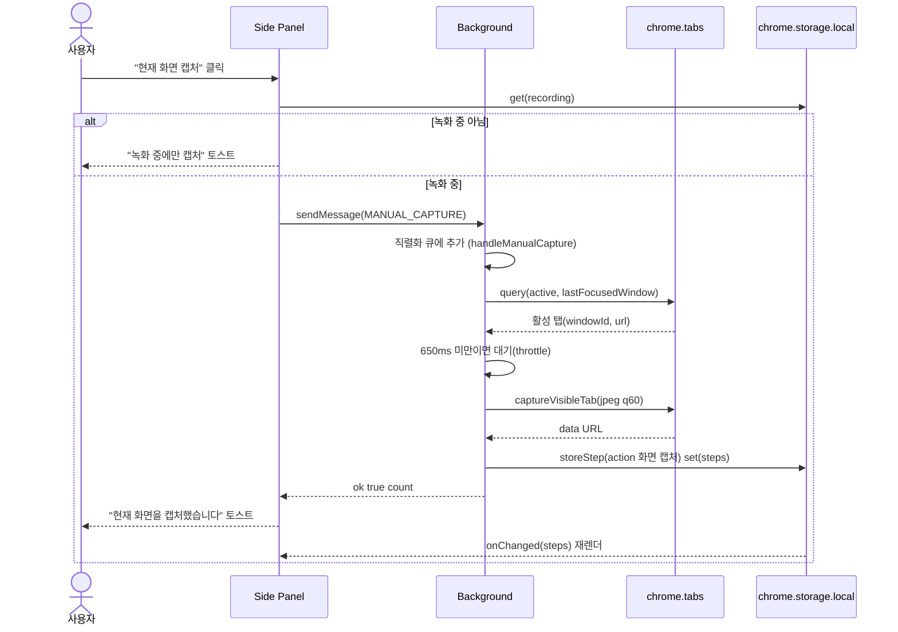
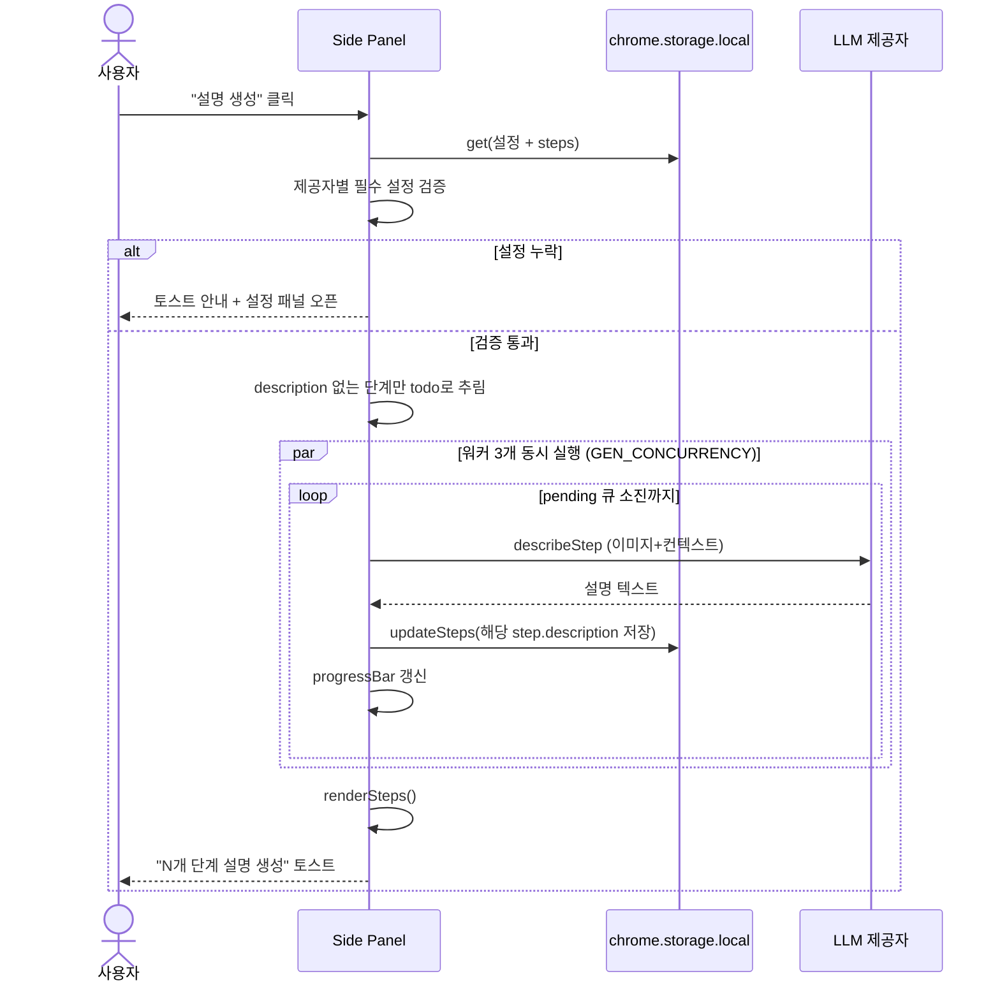
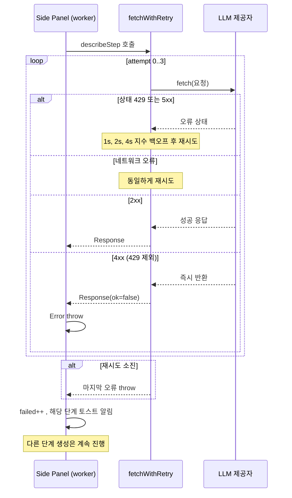
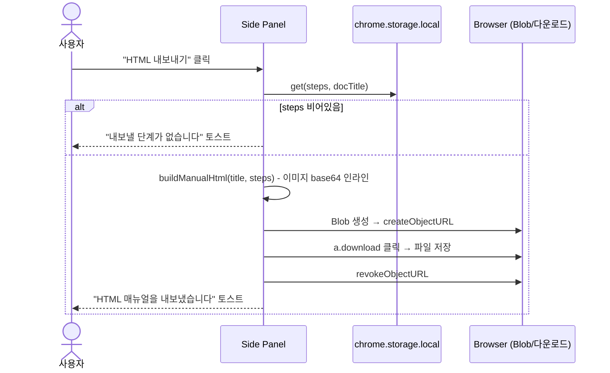

# UML 시퀀스 다이어그램 — Manual Capture

확장 내 3개 격리 컨텍스트(content / background / sidepanel)와 외부 LLM API 간의 핵심 흐름입니다. 메시지/저장 규약은 → [API 설계 문서](api-design.md).

---

## 1. 녹화 시작/토글 흐름

녹화 상태는 `chrome.storage.local.recording`에 저장되며, storage 변경 이벤트로 모든 컨텍스트에 전파됩니다.

---

## 2. 단계 수집 흐름 (핵심 비즈니스 로직)

사용자가 웹앱을 클릭/입력하면 content script가 메타데이터를 보내고, background가 스크린샷을 찍어 저장합니다.

---

## 3. 수동 캡처 흐름 (사이드패널 버튼)

녹화 중 "📷 현재 화면 캡처" 버튼을 누르면 클릭/입력과 무관하게 현재 화면을 단계로 추가합니다. `CAPTURE_STEP`과 달리 sidepanel이 메시지를 보내고, background가 활성 탭을 직접 조회합니다.

---

## 4. 설명 생성 흐름 (LLM 호출 + 동시성)

---

## 5. 에러 처리 / 재시도 흐름

`fetchWithRetry`는 429/5xx/네트워크 오류를 지수 백오프로 재시도하고, 단계별 실패는 격리합니다.

---

## 6. HTML 내보내기 흐름

