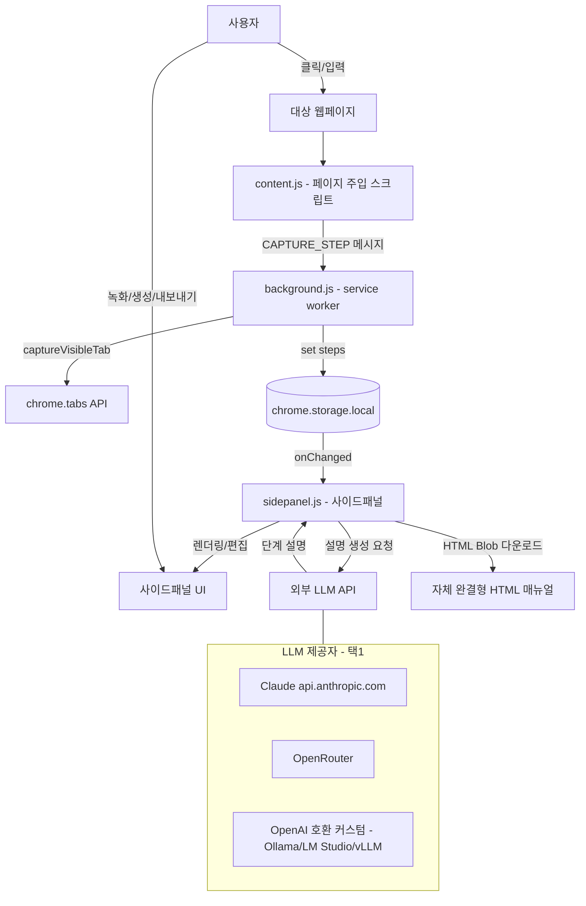

# 시스템 아키텍처 문서 — Manual Capture

## 1. 개요

| 항목 | 내용 |
|---|---|
| 시스템 목적 | 웹앱 사용 과정을 녹화 → 스크린샷 + AI 설명으로 단계별 HTML 매뉴얼 자동 생성 |
| 주요 사용자 | 비개발자(녹화 버튼만으로 매뉴얼 제작), 기술 문서 작성자 |
| 형태 | Chrome 확장 프로그램 (Manifest V3) |
| 규모 | 단일 사용자·로컬 동작. 서버/DB 없음. 단계 수백 개 수준 |
| 빌드 | 없음 — 순수 브라우저 확장 코드(빌드 시스템·외부 의존성 0) |

---

## 2. 아키텍처 다이어그램

확장은 서로 격리된 3개의 JS 컨텍스트로 나뉘며, `chrome.runtime.sendMessage`와 `chrome.storage.local`로 통신합니다.

---

## 3. 컴포넌트 설명 (SRP 관점)

| 컴포넌트 | 파일 | 책임 |
|---|---|---|
| Content Script | `content.js` | 클릭(`mousedown`)/입력(`change`) 감지, 요소 빨간 박스 강조, CSS selector·라벨·민감여부 판정 후 background로 전송. 값 자체(`el.value`)는 절대 기록하지 않음 |
| Background Worker | `background.js` | `CAPTURE_STEP` 수신, `captureVisibleTab` 스크린샷(스로틀), `steps` 저장. 휘발성 워커라 상태는 storage에만 보관 |
| Side Panel | `sidepanel.js` / `sidepanel.html` | 단계 렌더링, LLM 호출(동시 3개·재시도), 설명 편집/삭제, HTML 내보내기, 설정 관리, 수동 캡처(`MANUAL_CAPTURE`) 트리거 |
| Storage | `chrome.storage.local` | 단일 진실 공급원이자 컨텍스트 간 동기화 채널 |

---

## 4. 기술 스택 및 선정 이유

| 기술 | 선택 이유 |
|---|---|
| Manifest V3 | 현행 Chrome 확장 표준. service worker 기반 백그라운드 |
| 순수 JS (빌드 없음) | 의존성·번들러 부재로 즉시 로드/디버깅, 스타터 친화적 |
| `chrome.storage.local` + `unlimitedStorage` | 휘발성 워커 대응 영속 저장. 스크린샷 base64 보관 위해 무제한 용량 |
| 비전 LLM (Claude/OpenAI 호환) | 스크린샷을 보고 비개발자용 설명 자동 생성 |
| 자체 완결형 HTML 출력 | 이미지·CSS 인라인 → 오프라인·외부 의존 없이 공유 가능 |

---

## 5. 데이터 흐름

1. **수집**: 사용자 동작 → `content.js`가 메타데이터 추출 → `CAPTURE_STEP`. (또는 사이드패널의 수동 캡처 → `MANUAL_CAPTURE`로 현재 화면을 직접 단계화)
2. **캡처/저장**: `background.js`가 스크린샷(JPEG q60, 650ms 스로틀) → `steps`에 push(직렬화 큐).
3. **동기화**: `storage.onChanged(steps)` → `sidepanel.js`가 200ms 디바운스 후 재렌더.
4. **설명 생성**: 사용자가 "설명 생성" → 미설명 단계만 동시 3개 LLM 호출 → `description` 저장.
5. **출력**: `buildManualHtml`이 base64 이미지·CSS를 인라인한 단일 HTML을 Blob 다운로드.

상세 시퀀스는 → [시퀀스 다이어그램](sequence-diagrams.md), 저장 스키마는 → [DB 설계 문서](database-design.md).

---

## 6. 보안 / 개인정보 정책

- **민감 입력 차단**: input `type`이 `password`/`email`/`tel`/`number`/`hidden`이거나, name·id·autocomplete가 `/pass|pwd|secret|token|card|cvv|ssn|주민|비밀/i`에 매칭되면 → 값 미기록, 라벨은 `"[입력값 비공개]"`, 입력 동작 시 스크린샷 생략.
- **값 미수집 원칙**: 폼 필드는 식별 메타데이터만 기록하고 `el.value`는 어떤 경우에도 저장/전송하지 않음.
- **키 저장**: API 키는 기기 내 `chrome.storage.local`에만 저장. LLM 호출 헤더 외 외부 전송 없음.
- **CORS 우회**: Claude 직접 호출 시 `anthropic-dangerous-direct-browser-access: true`.

---

## 7. 비기능 요구사항

| 항목 | 정책 |
|---|---|
| 성능 — 캡처 | `captureVisibleTab` 최소 650ms 간격 스로틀(초당 제한 회피) |
| 성능 — 생성 | 동시 3개 병렬(약 1/3 시간), 재렌더 200ms 디바운스 |
| 안정성 | 단계 저장/생성 모두 Promise 직렬화 큐로 race 방지 |
| 복원력 | LLM 429/5xx/네트워크 오류 지수 백오프 재시도(최대 3회), 단계별 실패 격리 |
| 페이로드 | 스크린샷 JPEG 품질 60으로 압축 |

---

## 8. 배포 아키텍처

- **로딩**: `chrome://extensions` → 개발자 모드 → "압축해제된 확장 프로그램 로드" → `manual-capture-extension/` 선택.
- **패키징**: Chrome DevTools → Extensions → Pack extension (`manual-capture-extension.pem` 개인키 사용), 사전에 `manifest.json`의 `version` 갱신.
- **권한**: `activeTab`, `tabs`, `storage`, `scripting`, `sidePanel`, `unlimitedStorage` / host: `<all_urls>`, `api.anthropic.com`, `openrouter.ai`.

설치·운영 절차는 → [사용 설명서](user-guide.md).

---

## 9. 알려진 제약 & 의존성 지도

**제약**
- `captureVisibleTab`는 보이는 뷰포트만 캡처(아래 영역 미포함).
- 클릭 직후 페이지 이동 시 캡처가 다음 화면을 잡을 수 있음.
- cross-origin iframe 내부는 `content.js` 접근 불가.
- 넓은 배포 시 키 노출 위험 → 프록시 서버 경유 권장.

**외부 의존성**
| 의존 | 용도 | 비고 |
|---|---|---|
| Anthropic Messages API | 설명 생성 | `claude-sonnet-4-6` |
| OpenRouter API | 설명 생성 | OpenAI 호환 |
| 커스텀 OpenAI 호환 서버 | 설명 생성 | Ollama/LM Studio/vLLM 등 |
| Chrome Extension API | 전 기능 | tabs, storage, sidePanel, scripting |
